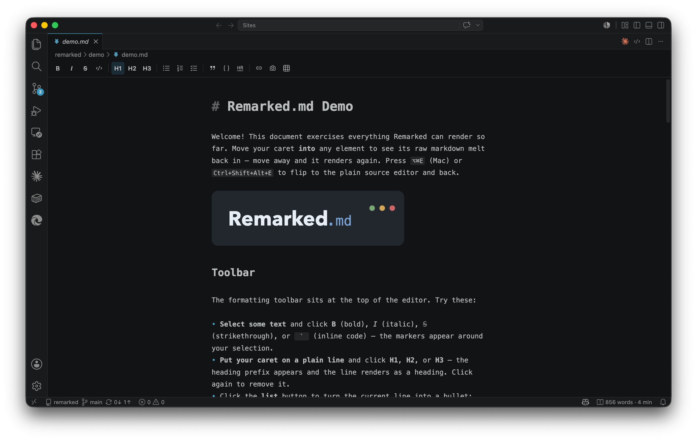
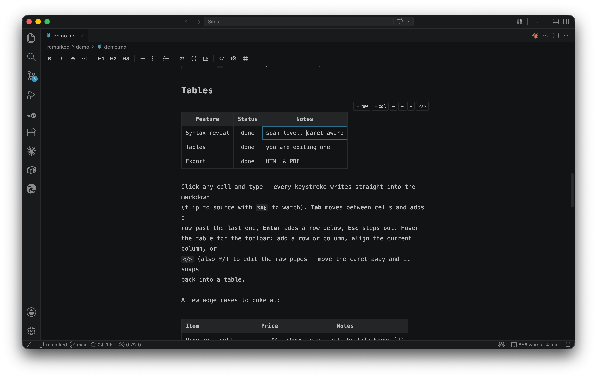
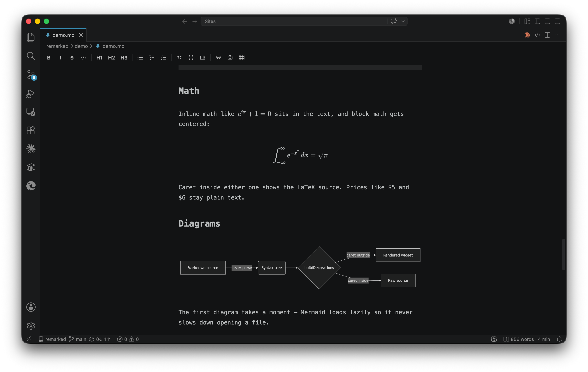
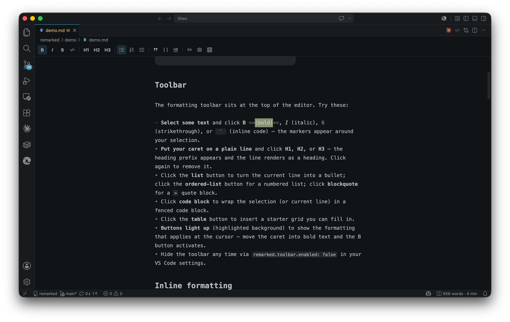

# Remarked.md

Live WYSIWYG markdown editing for VS Code. Open a `.md` file and the
document **is** the editor — headings, tables, math, diagrams and images
render in place, and only the syntax around your caret reveals while you
edit it.

- **Byte-perfect files.** The source text is the document model. No
  serialization, no reformatting, clean diffs.
- **Span-level syntax reveal** — only the markdown around your caret shows;
  never whole-paragraph flips.
- **Instant source toggle** — `⌥⌘E` (mac) / `Ctrl+Shift+Alt+E` reopens the
  same buffer in the plain text editor and back.
- **Formatting toolbar** at the top of the editor with bold, italic,
  strikethrough, inline code, headings (H1–H3), lists, blockquote, code block,
  horizontal rule, link, image, and table actions. Buttons reflect the
  formatting at the cursor. Hide it with `remarked.toolbar.enabled: false`.
- **GFM tables** you edit like a spreadsheet: click a cell and type, Tab/Enter
  to move, hover toolbar for rows, columns and alignment, `⌘/` to edit raw
  pipes.
- **KaTeX math**, **Mermaid diagrams**, clickable task lists, strikethrough.
- **Images**: paste or drag-drop saves into `assets/` (configurable) and
  inserts the link.
- **Navigate & write**: jump to heading (`⇧⌘O`), word count + reading time,
  focus mode, typewriter mode.
- **Export** to a single self-contained HTML file or to PDF (uses your
  installed Chrome/Edge — nothing bundled).
- **Make it yours**: `remarked.customCss` loads your stylesheet last, so
  your theme gets the final word.

## Screenshots

*The document **is** the editor — formatting renders in place, with the toolbar on top.*

*Click a cell and type; Tab/Enter to move; hover toolbar for rows, columns and alignment.*

*KaTeX math and Mermaid diagrams render live as you write.*

*Toolbar buttons light up to show the formatting at your caret.*

## Try it

Open [`demo/demo.md`](demo/demo.md) in Remarked to see everything in one
document — headings, GFM tables, KaTeX math, a Mermaid diagram, task lists, and
the formatting toolbar.

## Settings

| Setting | Default | What it does |
| --- | --- | --- |
| `remarked.imageFolder` | `assets` | Where pasted/dropped images are saved (relative to the document). |
| `remarked.customCss` | – | Path to a CSS file loaded after Remarked's styles. |
| `remarked.math.enabled` | `true` | Render KaTeX math. |
| `remarked.mermaid.enabled` | `true` | Render Mermaid diagrams. |
| `remarked.largeFileSizeMb` | `2` | Documents larger than this ask before rendering. |
| `remarked.export.embedImages` | `true` | Embed images as base64 in HTML exports. |
| `remarked.toolbar.enabled` | `true` | Show the formatting toolbar at the top of the editor. |

Prefer the plain text editor by default? Run **"Remarked.md: Toggle Remarked
as Default Markdown Editor"**.
