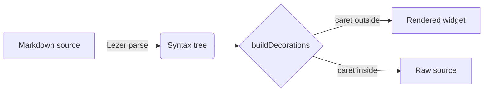

# Remarked.md Demo

Welcome! This document exercises everything Remarked can render so far. Move your caret **into** any element to see its raw markdown melt back in, then move away and it renders again. Press `⌥⌘E` (Mac) or `Ctrl+Shift+Alt+E` to flip to the plain source editor and back.


## Toolbar

The formatting toolbar sits at the top of the editor. Try these:

- **Select some text** and click **B** (bold), *I* (italic), ~~S~~ (strikethrough), or `` ` `` (inline code), and the markers appear around your selection.
- **Put your caret on a plain line** and click **H1**, **H2**, or **H3**, and the heading prefix appears and the line renders as a heading. Click again to remove it.
- Click the **list** button to turn the current line into a bullet; click the **ordered-list** button for a numbered list; click **blockquote** for a `>` quote block.
- Click **code block** to wrap the selection (or current line) in a fenced code block.
- Click the **table** button to insert a starter grid you can fill in.
- **Buttons light up** (highlighted background) to show the formatting that applies at the cursor; move the caret into bold text and the B button activates.
- Hide the toolbar any time via `remarked.toolbar.enabled: false` in your VS Code settings.

## Inline formatting

This line has **bold text**, *italics*, ~~strikethrough~~, and `inline code`. Click inside any of them and the markers reappear, dimmed, exactly where you left them. Try **⌘B**, *⌘I*, and `⌘\`` on a selection, and ⌘K to insert a [link](https://github.com/phyrdaus/remarked).

Hover that link to see where it goes; ⌘-click opens it in your browser.

## Headings

### This is an h3

The `#` marks hide until your caret lands on the heading line.

## Lists and tasks

- Bullets render as proper dots
- Press **Enter** at the end of this line and the list continues by itself
  - Nested items work too
- Press **Backspace** on an empty item to dissolve it

1. Ordered lists keep their numbers
2. Styled, but visible

And a task list: **click the checkboxes**, then flip to source (`⌥⌘E`) to watch `[x]` appear in the file:

- [ ] Click me
- [ ] Then me
- [x] Already done (notice the strikethrough)

## Quotes

> Multi-line quotes get a bar on every line,
> and the `>` markers stay hidden until you edit them.

## Tables

| Feature | Status | Notes |
| --- | :---: | --- |
| Syntax reveal | done | span-level, caret-aware |
| Tables | done | you are editing one |
| Export | done | HTML & PDF |

Click any cell and type; every keystroke writes straight into the markdown
(flip to source with `⌥⌘E` to watch). **Tab** moves between cells and adds a
row past the last one, **Enter** adds a row below, **Esc** steps out. Hover
the table for the toolbar: add a row or column, align the current column, or
`</>` (also **⌘/**) to edit the raw pipes, then move the caret away and it snaps
back into a table.

A few edge cases to poke at:

| Item | Price | Notes |
| :--- | ---: | --- |
| Pipe in a cell | $4 | shows as a \| but the file keeps `\|` |
| Empty cell next door |  | type into me |
| Right-aligned prices | $12 | via the delimiter row |

Loose style works too: no edge pipes, and the short last row gets phantom
cells you can type into (watch the source grow the row):

Name | Role
--- | ---
Ada | engineer
Bob

And the safety net: this table contains inline HTML, which can't be mapped
back to source safely, so Remarked refuses to widget it and leaves the raw
pipes alone instead of risking your bytes:

| HTML inside | stays |
| --- | --- |
| <kbd>⌘/</kbd> | raw, on purpose |

Try the corruption test: put this file side-by-side with a text editor, type
in a cell here, and watch only that cell's bytes change over there.

## Code

```python
def fib(n: int) -> int:
    """Lazy-loaded syntax highlighting: 100+ languages."""
    return n if n < 2 else fib(n - 1) + fib(n - 2)
```

```js
const reveal = (caret, span) => caret >= span.from && caret <= span.to;
```

## Math

Inline math like $e^{i\pi} + 1 = 0$ sits in the text, and block math gets centered:

$$
\int_{-\infty}^{\infty} e^{-x^2}\,dx = \sqrt{\pi}
$$

Caret inside either one shows the LaTeX source. Prices like $5 and $6 stay plain text.

## Diagrams



The first diagram takes a moment; Mermaid loads lazily so it never slows down opening a file.

## Images & navigation

Paste an image from your clipboard, or drag an image file into the document,
and it lands in `assets/` next to this file (configurable via
`remarked.imageFolder`) and a relative link appears right where you dropped
it. Try `⌘⇧O` to jump between headings, and watch the word count in the
status bar tick as you type.

## Everything else

A horizontal rule:

---

**Focus mode** (Command Palette → "Remarked: Toggle Focus Mode") dims everything but the paragraph you're editing. **Typewriter mode** keeps your caret vertically centered while you type.

And the most important feature is the one you can't see: open this file side-by-side with the plain text editor (right-click the tab → *Reopen Editor With* → *Text Editor* in a split) and edit in both; every byte stays exactly where you put it.

When you're done writing, take it with you: **⌘⇧P → "Remarked.md: Export to
HTML"** produces a single self-contained file (styles, math fonts, diagrams
and images all inlined), and **"Export to PDF"** prints it through your
installed Chrome or Edge.
